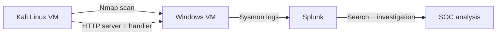
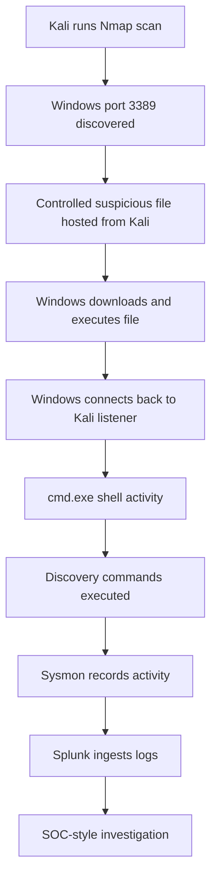

# Windows Endpoint Detection Lab

## 1. Project Title

**Windows Endpoint Detection Lab: Sysmon + Splunk Telemetry Analysis**

---

## 2. Short Intro / Summary and Lab Diagram

This project is a SOC-style home lab built to practice endpoint telemetry analysis using Kali Linux, a Windows VM, Sysmon, and Splunk. The goal was to generate controlled suspicious activity in an isolated virtual lab, collect the resulting logs, and investigate them from a SOC analyst perspective.



---

## 3. Step-by-Step Walkthrough Including Splunk Investigation

### Step 1: Lab Environment Setup

The lab used two virtual machines on the same VirtualBox NAT Network:

* Kali Linux VM
* Windows VM

The Windows VM was configured with Sysmon and Splunk so endpoint activity could be collected and searched.


---

### Step 2: Network Scanning with Nmap

From Kali, I used Nmap to scan the Windows VM and identify open ports.

The scan identified port `3389` as open, which indicates that RDP/Remote Desktop was available on the Windows machine.


SOC relevance:

Port `3389` is important because RDP is commonly targeted for remote access, brute force attempts, and lateral movement. An open port does not automatically mean the system is compromised, but it is worth investigating.

---

### Step 3: Controlled Suspicious Executable Activity

A controlled suspicious executable was generated and executed only inside the isolated lab environment. The goal was not exploitation, but to create endpoint telemetry for detection and investigation practice.

The file was hosted from Kali using a temporary Python HTTP server so the Windows VM could download it.


---

### Step 4: Reverse TCP Handler

Metasploit multi/handler was used as the listener on Kali. The handler waited for the Windows VM to connect back.


This confirmed that the Windows VM created a connection back to the Kali VM.

---

### Step 5: Sysmon Logs Ingested into Splunk

Splunk was configured to ingest Sysmon logs into the `endpoint` index.

Sample search:

```spl
index=endpoint
```


This confirmed that Sysmon telemetry was successfully searchable in Splunk.

---

### Step 6: Destination Port Investigation

I reviewed destination ports to understand what services the Windows VM communicated with.

Sample search:

```spl
index=endpoint EventCode=3
| table _time Image SourceIp SourcePort DestinationIp DestinationPort
```


Observed ports:

| Port | Meaning                        | Why It Matters                                  |
| ---- | ------------------------------ | ----------------------------------------------- |
| 3389 | RDP / Remote Desktop           | May indicate remote access exposure or scanning |
| 4444 | Kali listener port in this lab | Helped confirm reverse connection activity      |

---

### Step 7: ProcessGuid Investigation

Instead of relying only on Process ID, I used Sysmon `ProcessGuid` to trace process activity more accurately.

Sample search:

```spl
index=endpoint {PROCESS-GUID-HERE}
| table _time ParentImage CommandLine
```


This helped identify the parent-child process relationship between the suspicious executable, `cmd.exe`, and the discovery commands.

---

### Step 8: Command Discovery Activity

Inside the shell session, commands such as `net user`, `net localgroup`, and `ipconfig` were executed to generate discovery telemetry.

Sample search:

```spl
index=endpoint ("net user" OR "net localgroup" OR "ipconfig")
| table _time ParentImage CommandLine
```


These commands are useful to investigate because they can indicate local user, group, and network discovery activity.

---

## 4. Skills Demonstrated

* SOC alert investigation
* Windows endpoint telemetry analysis
* Sysmon log collection
* Splunk searching and filtering
* Process creation analysis
* Parent-child process investigation
* Network connection analysis
* Basic detection engineering
* Documentation and reporting

---

## 5. Tools Used

| Tool                     | Purpose                           |
| ------------------------ | --------------------------------- |
| Kali Linux               | Attacker/telemetry generation VM  |
| Windows VM               | Target endpoint                   |
| VirtualBox               | Virtualized lab environment       |
| Nmap                     | Port scanning                     |
| Sysmon                   | Endpoint telemetry collection     |
| Splunk                   | Log ingestion and investigation   |
| Metasploit multi/handler | Reverse connection handler        |
| Python HTTP Server       | Temporary file hosting in the lab |

---

## 6. Attack / Telemetry Flow



---

## 9. Key Findings

* Nmap identified port `3389` as open, indicating that RDP was available on the Windows VM.
* Splunk successfully ingested Sysmon logs into the `endpoint` index.
* Sysmon EventCode `1` showed process creation activity.
* Sysmon EventCode `3` showed network connection activity.
* The suspicious executable created a reverse connection back to the Kali VM.
* Process investigation showed command shell activity and discovery commands such as `net user`, `net localgroup`, and `ipconfig`.
* The strongest evidence came from correlating process creation, command-line activity, and network connections together.

---

## 10. Screenshots

| Screenshot                          | Description                                   |
| ----------------------------------- | --------------------------------------------- |
| `01-lab-environment.png`            | Kali and Windows VM lab setup                 |
| `02-nmap-scan-rdp-3389.png`         | Nmap scan showing RDP port 3389               |
| `03-http-server-download.png`       | Python HTTP server used for lab file transfer |
| `04-metasploit-handler-session.png` | Handler showing reverse connection            |
| `05-splunk-endpoint-index.png`      | Splunk receiving Sysmon logs                  |
| `06-destination-ports.png`          | Destination ports observed in Splunk          |
| `07-process-guid-investigation.png` | ProcessGuid-based investigation               |
| `08-command-discovery-logs.png`     | Discovery commands found in Splunk            |

---

## 11. Lessons Learned

* Sysmon provides useful visibility into endpoint activity such as process creation and network connections.
* Splunk can be used to investigate suspicious behavior by correlating multiple event types.
* Open ports, suspicious filenames, command shell activity, and outbound connections are more meaningful when analyzed together.
* ProcessGuid is useful because it helps track a process more reliably than only using Process ID.
* A single event does not automatically prove malicious activity; context and correlation are important in SOC investigations.
